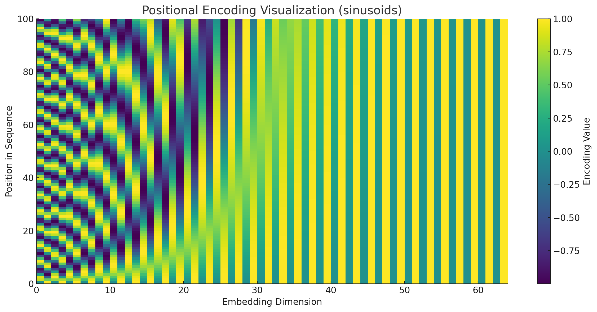

# Positional Encoding

Intuition: Transformers use a mechanism called "self-attention," which is great at figuring out how different words in a sentence relate to each other, _regardless_ of their position. It looks at all words simultaneously. But wait... doesn't word order matter? "Dog bites man" is quite different from "Man bites dog," right? 😅

The standard self-attention mechanism, by itself, doesn't inherently know the _position_ of a word or token in a sequence. It treats the input like a "bag of words" where order is lost.

That's where **Positional Encoding** comes in. It's like adding a little timestamp or address label to each word's embedding (the vector representation of the word) _before_ it goes into the Transformer layers. This label gives the model information about the word's position in the sequence.

So, in short: Positional Encoding injects information about the _order_ of tokens into the model, which the core self-attention mechanism otherwise lacks.

## Analogy: The Label Factory

Think of it like this:

1.  **The Problem:** The Transformer's attention mechanism is like looking at all the words in a sentence jumbled in a bag. It's great at seeing _which_ words are important to each other, but terrible at knowing _where_ they are in the sequence (first, second, last?).
2.  **The Solution:** We need to sneakily give each word a hint about its position _before_ it goes into that attention bag-of-words thingy.
3.  **Positional Encoding's Job:** It's the factory that makes unique "position hint" labels (vectors). For sentences up to a certain length (`max_len`), it makes a unique label vector for each possible position (0, 1, 2, ... `max_len`-1).

How does this relate to the PyTorch code?

- **`__init__` (The Label Factory Setup):** This runs _once_ when you create the `PositionalEncoding` object. Its main job is to **pre-calculate all the possible position labels** (up to `max_len`) using those sine/cosine formulas. Think of it as printing out a big sheet of unique, complex address labels. The `register_buffer` part just stores this sheet efficiently.
- **`forward(self, x)` (Applying the Labels):** This runs _every time_ you feed data (`x`, your word embeddings) through the model. It looks at how long the current sequence is, goes to the big sheet of pre-printed labels, **grabs only the labels needed** for that length, and simply **adds** the corresponding position label vector to each word embedding vector. Word embedding + Position label = Embedding with position info!

**Gingerbread Analogy:** Imagine word embeddings are plain gingerbread cookies (they have "meaning"). Positional Encoding adds unique sprinkles based on position (1st cookie gets red, 2nd gets green, etc.). `__init__` prepares all sprinkle patterns; `forward` puts the right sprinkles on the current batch of cookies.

The most famous type, introduced in the original [Attention Is All You Need](https://arxiv.org/pdf/1706.03762) paper, is **Sinusoidal Positional Encoding**. It uses sine and cosine functions of different frequencies:

- For each position in the sequence (e.g., 1st word, 2nd word, etc.), it calculates a unique positional vector.
- This vector has the same dimension as the word embeddings so they can be added together.
- The values in the vector are determined by `sin` and `cos` functions applied to the position index, scaled by different wavelengths.

The cool thing about the sinusoidal approach is:

1.  It produces a unique encoding for each position.
2.  The distance between encodings for nearby positions is consistent.
3.  The model can potentially extrapolate to sequence lengths longer than those seen during training because the pattern is based on continuous functions.

## Math

The sinusoidal positional encoding is defined as:

$$
PE(pos, 2i) = sin \left( \frac{pos}{10000^{\frac{2i}{d}}} \right)
PE(pos, 2i+1) = cos \left( \frac{pos}{10000^{\frac{2i}{d}}} \right)
$$

Where:

- `pos` is the position in the sequence (e.g., 1st word, 2nd word, etc.).
- `i` is the dimension index (0, 1, 2, etc.).
- `d` is the dimension of the embeddings (e.g., 512 for BERT base).

This formula ensures that:

- Each position gets a unique encoding.
- The encoding for nearby positions is similar.
- The model can handle longer sequences because the pattern is continuous.

## Implementation

```python
import torch
import math

def sinusoidal_positional_encoding(max_len, d_model):
    pe = torch.zeros(max_len, d_model)
    position = torch.arange(0, max_len, dtype=torch.float32).unsqueeze(1)
    div_term = torch.exp(torch.arange(0, d_model, 2, dtype=torch.float32) * -(math.log(10000.0) / d_model))
    pe[:, 0::2] = torch.sin(position * div_term)
    pe[:, 1::2] = torch.cos(position * div_term)
    return pe
```

This function creates a positional encoding matrix `pe` of shape `(max_len, d_model)`. It uses sine and cosine functions to generate unique encodings for each position in the sequence.

## Example Usage

Here's how you might use this function in practice:

```python
max_len = 100
d_model = 64
pe = sinusoidal_positional_encoding(max_len, d_model)
print(pe)
```

This will output a positional encoding matrix of shape `(100, 64)`. Each row in this matrix represents the positional encoding for a specific position in the sequence.

## Visualization

Here's a visualization of the positional encoding for a sequence of length 100 and embedding dimension 64:



This visualization shows how the positional encoding varies across different positions and dimensions. The colors represent different frequencies in the sinusoidal functions used to generate the encoding.

- **Y-axis (Position in Sequence, 0-100):** This represents the position of a token in the input sequence. So, this visualization covers sequences up to a length of 100 (`max_len = 100`). Each row corresponds to the unique positional encoding vector for that specific position.
- **X-axis (Embedding Dimension, 0-~64):** This represents the dimensions of the embedding vector (`d_model = 64`). Each column corresponds to a specific dimension within the positional encoding vector.
- **Color Intensity (Encoding Value):** This shows the actual value calculated for each position (`pos`) and dimension (`i`) using those sine and cosine functions we mentioned. Yellow is high (close to 1), dark purple/blue is low (close to -1).

You can see the wavy patterns (sinusoids) changing frequency across the embedding dimension. Lower dimensions (left side) have longer wavelengths (change slowly), while higher dimensions (right side) have shorter wavelengths (change quickly). This combination creates a unique vector signature for each position along the sequence length.

So, if you had a word embedding of size 64 for the word at position, say, 30, you would simply add the vector represented by row 30 in this image to that word embedding. Ta-da! Positional information embedded.

## Summary

Positional Encoding is a crucial component in the Transformer model architecture. It provides the model with information about the position of tokens in the sequence, which is essential for understanding the context and order of words.

The sinusoidal positional encoding is a well-known and effective way to encode positional information into the model. It ensures that each position gets a unique encoding and that the encoding for nearby positions is similar, allowing the model to handle longer sequences.
