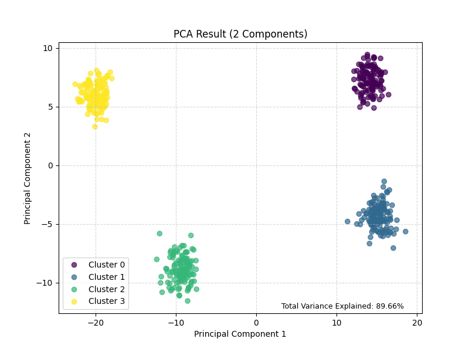

# Principal Component Analysis (PCA)

Imagine you have way too much information about something, like hundreds of measurements for every item in a dataset. It's hard to see patterns or visualize this data directly.

**PCA is like a smart summarizer for complex data.**

## The Problem: Too Many Dimensions

Think of having a spreadsheet with 500 columns (dimensions or features) describing different things. Plotting this or easily understanding relationships is impossible.

## PCA's Goal: Simplify!

PCA aims to reduce these 500 dimensions down to just a few (like 2 or 3) while losing the least amount of important information possible.

## How it Works (Analogy: Finding the "Main Things")

1.  **Look at Everything:** PCA analyzes all 500 original measurements.
2.  **Find PC1:** It mathematically finds the _best combination_ of the original measurements that shows the biggest variation or difference across your items. This combination becomes a new single dimension called **Principal Component 1 (PC1)**. It's the single most important "summary axis."
3.  **Find PC2:** It then finds the _next best combination_ that explains the most _remaining_ variation, with the condition that this new axis must be completely independent (orthogonal) of PC1. This is **Principal Component 2 (PC2)**.
4.  **Repeat:** It continues finding these Principal Components (PC3, PC4...), each capturing less and less of the remaining variation, and each being independent of all previous ones.

## The "Magic" - Dimensionality Reduction

- Often, the first few PCs (especially PC1 and PC2) capture a large percentage of the total information (variance) present in the original 500 dimensions.
- We can decide to **keep only these first few PCs** (e.g., just PC1 and PC2) and discard the rest.
- Now, each item can be represented by its score on just these few principal components instead of the original 500 measurements.
- We've successfully reduced the dimensions (e.g., from 500D to 2D)!

## Analogy: Casting a Shadow

Think of a complex 3D object. PCA is like finding the best angle to shine a light so the 2D shadow it casts on a wall captures the object's most defining shape.

- The **direction of the light** represents a Principal Component.
- The **2D shadow** is the lower-dimensional representation.
- You lose some detail (depth), but you retain the most important visual information (the main outline).

## Why Use It?

If you have word embeddings with 300 dimensions, you can use PCA to reduce them to 2 or 3 dimensions. Plotting these 2D/3D points might reveal clusters of similar words or other interesting structures that were hidden in the original high-dimensional space.

**In short:** PCA finds the most important underlying patterns or directions in complex data and uses them to create a simpler, lower-dimensional summary.

## Example

```terminal
Original data shape: (500, 10)

Applying PCA to reduce dimensions to 2...
Transformed data shape: (500, 2)
Explained variance ratio by component: [0.74226629 0.15433026]
Total explained variance: 0.8966

Plotting the PCA-transformed data...
2025-04-15 12:55:14.948 python[77257:13480831] +[IMKClient subclass]: chose IMKClient_Modern
2025-04-15 12:55:14.948 python[77257:13480831] +[IMKInputSession subclass]: chose IMKInputSession_Modern

PCA Example Complete.
Note: PCA finds linear projections that maximize variance.
The plot shows the data projected onto the first two principal components.
```



1.  **`Original data shape: (500, 10)`**
    *   **Translation:** "We started with 500 data points (like 500 LEGO bricks), and each brick had 10 different characteristics or measurements (like color, size, number of studs, shape, etc.)."

2.  **`Applying PCA to reduce dimensions to 2...`**
    *   **Translation:** "Alright, starting the PCA magic trick to simplify things down to just 2 main characteristics!"

3.  **`Transformed data shape: (500, 2)`**
    *   **Translation:** "Abracadabra! We still have our 500 LEGO bricks, but now we're describing each one using only the 2 *most important* summary characteristics we found." Dimension reduction achieved!

4.  **`Explained variance ratio by component: [0.74226629 0.15433026]`**
    *   **Translation:** "Okay, how much info did we keep?"
        *   `0.742...`: "The *first* summary characteristic (Principal Component 1) managed to capture about 74.2% of all the differences between the original bricks." That's a big chunk!
        *   `0.154...`: "The *second* summary characteristic (Principal Component 2) captured an *additional* 15.4% of the original differences."
    *   **In essence:** PC1 is the most important way the data varies, and PC2 is the *next* most important way that's *different* from PC1.

5.  **`Total explained variance: 0.8966`**
    *   **Translation:** "If we add up the info captured by PC1 (74.2%) and PC2 (15.4%), we find that our new 2-characteristic summary holds about **89.7%** of the original variation from the 10 characteristics. We threw away 8 characteristics but kept almost 90% of the important differences! Pretty efficient summarizing, right?"

6.  **`Plotting the PCA-transformed data...`**
    *   **Translation:** "Show me the picture!"


7.  **`PCA Example Complete.`**
    *   **Translation:** "Done!"

8.  **`Note: PCA finds linear projections that maximize variance.`** and **`The plot shows the data projected onto the first two principal components.`**
    *   **Translation:** "Just reminding you: PCA found the best flat 'shadow' (linear projection) that showed the most spread (variance), and the picture you saw uses those two best summary axes (PC1 and PC2)."

So, the key takeaways are: you successfully reduced 10 dimensions to 2, and those 2 dimensions still capture nearly 90% of the original data's variation, allowing you to see the clusters clearly in the plot.


