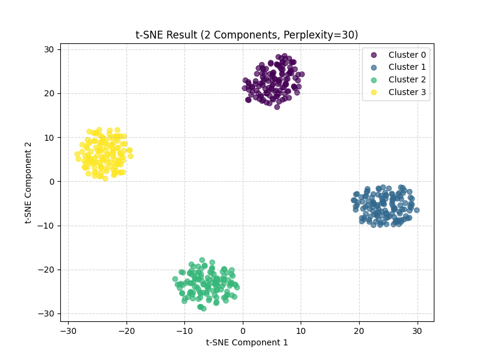

# t-Distributed Stochastic Neighbor Embedding (t-SNE)

Imagine you have complex, high-dimensional data (like word embeddings). PCA helps summarize the biggest overall trends. t-SNE has a different, more specific goal: **showing how points group together locally.**

**t-SNE is like an expert party planner trying to arrange guests so friends stay close to friends.**

## The Problem: Seeing Local Groups

Sometimes, the most interesting patterns aren't the biggest overall variations (PCA's focus), but rather the small, tight clusters of similar items hidden within the data.

## t-SNE's Goal: Preserve Neighborhoods!

t-SNE aims to create a low-dimensional map (usually 2D or 3D) where points that were **close neighbors** in the original high-dimensional space remain **close neighbors** on the map. It prioritizes preserving this local structure.

## How it Works (Analogy: Arranging a Party)

1.  **Measure High-D Friendships:** First, t-SNE looks at every pair of points in the original high-dimensional space and calculates a "similarity score" based on how close they are. Very close points get high scores (strong friendships).
2.  **Randomly Place Guests:** It then scatters points randomly onto a low-dimensional map (e.g., a 2D dance floor).
3.  **The Similarity Dance:** It calculates similarity scores between points on the _low-dimensional map_. Then, it iteratively moves the points around on the map.
4.  **Match the Vibe:** The goal is to adjust the map positions until the low-dimensional similarities closely match the original high-dimensional similarities. It shuffles guests until friends are near friends.

## Key Features & Differences from PCA

- **Excellent at Finding Clusters:** t-SNE's focus on local neighborhoods makes it very good at revealing distinct groups or clusters in the data if they exist.
- **Non-Linear:** It can capture complex, twisty relationships that PCA's straight-line (linear) approach would miss.
- **Relative Distances Matter:** It cares more about _which_ points are near each other than the _exact_ distances. The size of clusters and the distance _between_ separate clusters on a t-SNE plot might not accurately reflect the original data separations. Don't over-interpret these aspects!
- **Computationally Intensive:** The iterative adjustment process typically takes longer than PCA.

## Analogy: Social Network Map

- **PCA** might draw a map showing broad trends like "Influence vs. Activity".
- **t-SNE** draws a map specifically to make tight-knit friend groups clearly visible, even if it slightly warps the distances between different groups.

## Why Use It?

Use t-SNE when you want to visually explore your embeddings to see if meaningful **clusters** emerge. Do words related to "animals" group together? Do words related to "food" form another distinct cluster? t-SNE is ideal for this kind of exploratory visualization.

**In short:** t-SNE is a powerful non-linear technique for visualizing high-dimensional data, particularly excelling at revealing local cluster structures.

## Example

```terminal
Original data shape: (500, 10)

Applying t-SNE to reduce dimensions to 2...
(Using perplexity=30, iterations=1000)

/Users/leonvanbokhorst/agile-learning test/.venv/lib/python3.10/site-packages/sklearn/manifold/_t_sne.py:1164: FutureWarning: 'n_iter' was renamed to 'max_iter' in version 1.5 and will be removed in 1.7.
  warnings.warn(
Transformed data shape: (500, 2)
t-SNE KL divergence: 0.7566
t-SNE computation time: 0.55 seconds

Plotting the t-SNE-transformed data...
2025-04-15 12:58:18.751 python[77758:13485164] +[IMKClient subclass]: chose IMKClient_Modern
2025-04-15 12:58:18.751 python[77758:13485164] +[IMKInputSession subclass]: chose IMKInputSession_Modern

t-SNE Example Complete.
Note: t-SNE is non-linear and excels at revealing local cluster structure.
Distances between clusters and cluster sizes in the plot might not be globally meaningful.
```



1.  **`Original data shape: (500, 10)`**
    *   **Translation:** "We started with 500 data points (like 500 LEGO bricks), and each brick had 10 different characteristics or measurements (like color, size, number of studs, shape, etc.)."

2.  **`Applying t-SNE to reduce dimensions to 2...`**
    *   **Translation:** "Alright, starting the t-SNE magic trick to simplify things down to just 2 main characteristics!"

3.  **`Transformed data shape: (500, 2)`**
    *   **Translation:** "Abracadabra! We still have our 500 LEGO bricks, but now we're describing each one using only the 2 *most important* summary characteristics we found." Dimension reduction achieved!

4.  **`t-SNE KL divergence: 0.7566`**
    *   **Translation:** "Okay, how much info did we keep?"

5.  **`t-SNE computation time: 0.55 seconds`**
    *   **Translation:** "How long did it take to do the magic trick?"

6.  **`Plotting the t-SNE-transformed data...`**
    *   **Translation:** "Show me the picture!"

7.  **`t-SNE Example Complete.`**
    *   **Translation:** "Done!"

