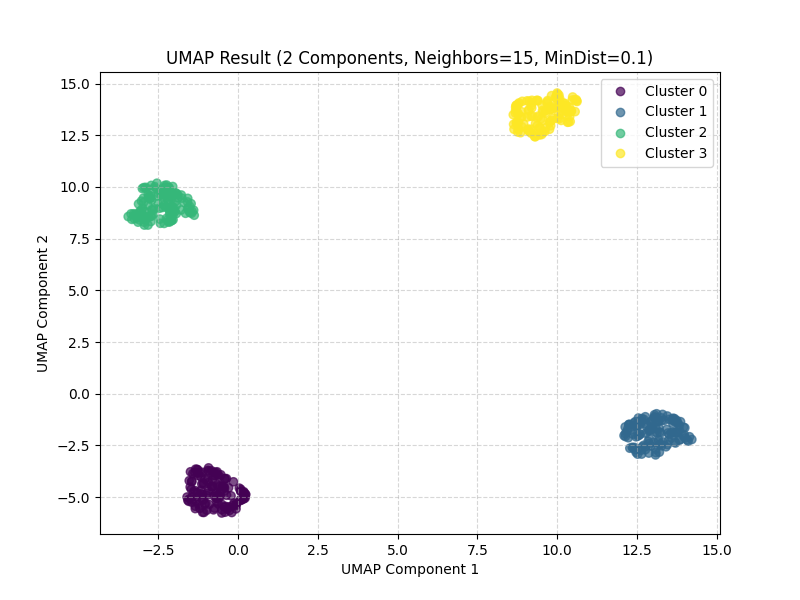

# Uniform Manifold Approximation and Projection (UMAP)

Imagine PCA summarizes the main trends and t-SNE focuses intently on local friend groups. UMAP tries to be the balanced one, capturing both local details and the bigger picture.

**UMAP is like carefully uncrumpling a complex map to lay it flat while preserving both local landmarks and overall continent shapes.**

## The Problem: Getting the Whole Picture

Sometimes you want to see not just the tiny clusters (like t-SNE shows well) but also how these clusters relate to each other in the grand scheme of things, without losing the non-linear structure that PCA ignores.

## UMAP's Goal: Balanced Representation

UMAP aims to create a low-dimensional map (2D/3D) that faithfully represents the underlying **shape or structure ("manifold")** of the high-dimensional data. It tries to preserve:

1.  **Local Structure:** Points that were neighbors in high-D remain neighbors in low-D.
2.  **Global Structure:** The large-scale relationships between different groups or parts of the data are also maintained reasonably well.

## How it Works (Analogy: Uncrumpling a Map)

1.  **Trace High-D Connections:** UMAP first looks at the high-dimensional data and builds a sort of "fuzzy graph" representing which points are close neighbors and how strongly they are connected. Think of this as understanding the structure of a crumpled map.
2.  **Build Low-D Framework:** It then creates a similar fuzzy graph structure in the low-dimensional (e.g., 2D) space.
3.  **Optimize the Layout:** The core step is arranging the points in the low-dimensional space so that its fuzzy graph matches the original high-dimensional one as closely as possible. It uses concepts from topology (math about shapes) to perform this layout optimization – like carefully smoothing the crumpled map onto a table without tearing it.

## Key Features & Differences

- **Good Balance:** Often considered a great balance between preserving local detail (like t-SNE) and global structure (better than t-SNE).
- **Non-Linear:** Captures complex, curved relationships in the data.
- **Performance:** Frequently faster than t-SNE, especially on larger datasets or higher dimensions.
- **Preserves Global Structure Better (Often):** The relative positions and distances between clusters in a UMAP plot can sometimes be more meaningful than in t-SNE.

## Analogy: City Map vs. Globe Projection

- **PCA:** Simple overview map based on main axes of variation.
- **t-SNE:** Detailed neighborhood map, great for local spots, might distort overall city layout.
- **UMAP:** A high-quality map aiming for accuracy both within neighborhoods and in how neighborhoods connect across the city.

## Why Use It?

UMAP is a popular and powerful choice for embedding visualization because it's often fast and provides insightful plots. It allows you to see potential clusters while also getting a better sense of the overall "landscape" of your embedding space.

**In short:** UMAP is a versatile, non-linear dimensionality reduction technique that excels at creating low-dimensional visualizations that balance local detail with global structure, often faster than t-SNE.

## Example

```terminal
Original data shape: (500, 10)

Applying UMAP to reduce dimensions to 2...
(Using n_neighbors=15, min_dist=0.1)

/Users/leonvanbokhorst/agile-learning test/.venv/lib/python3.10/site-packages/sklearn/utils/deprecation.py:151: FutureWarning: 'force_all_finite' was renamed to 'ensure_all_finite' in 1.6 and will be removed in 1.8.
  warnings.warn(
/Users/leonvanbokhorst/agile-learning test/.venv/lib/python3.10/site-packages/umap/umap_.py:1952: UserWarning: n_jobs value 1 overridden to 1 by setting random_state. Use no seed for parallelism.
  warn(
Transformed data shape: (500, 2)
UMAP computation time: 3.21 seconds

Plotting the UMAP-transformed data...
2025-04-15 13:02:19.562 python[78768:13491619] +[IMKClient subclass]: chose IMKClient_Modern
2025-04-15 13:02:19.562 python[78768:13491619] +[IMKInputSession subclass]: chose IMKInputSession_Modern

UMAP Example Complete.
Note: UMAP is non-linear and aims to balance local and global structure.
It's often faster than t-SNE and can provide good cluster separation and global layout.
```



1.  **`Original data shape: (500, 10)`**
    *   **Translation:** "We started with 500 data points (like 500 LEGO bricks), and each brick had 10 different characteristics or measurements (like color, size, number of studs, shape, etc.)."

2.  **`Applying UMAP to reduce dimensions to 2...`**
    *   **Translation:** "Alright, starting the UMAP magic trick to simplify things down to just 2 main characteristics!"

3.  **`Transformed data shape: (500, 2)`**
    *   **Translation:** "Abracadabra! We still have our 500 LEGO bricks, but now we're describing each one using only the 2 *most important* summary characteristics we found." Dimension reduction achieved!

4.  **`UMAP computation time: 3.21 seconds`**
    *   **Translation:** "How long did it take to do the magic trick?"

5.  **`Plotting the UMAP-transformed data...`**
    *   **Translation:** "Show me the picture!"

6.  **`UMAP Example Complete.`**
    *   **Translation:** "Done!"
