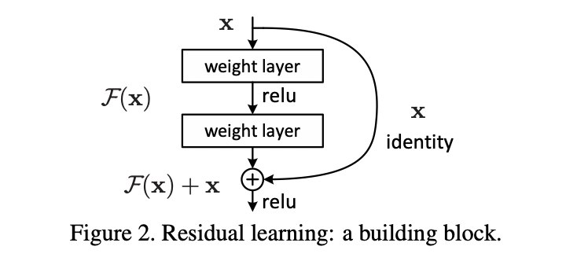

# Residual Connections (Skip Connections) and Add & Norm

## What are Residual Connections?

Residual Connections, also known as Skip Connections, are a fundamental architectural element in deep neural networks, popularized by ResNet (Residual Networks) and heavily used in Transformers.

The core idea is simple: allow the network to bypass one or more layers by adding the input of a block ($x$) directly to the output of that block ($F(x)$).

Instead of learning a transformation $H(x) = F(x)$, the layer(s) within the block learn the _residual_ function $F(x) = H(x) - x$. The final output is then computed as:

$$ \text{Output} = F(x) + x $$

  
_(Image Source: [He et al., 2015 - Deep Residual Learning for Image Recognition](https://arxiv.org/pdf/1512.03385)_

## Why Use Them?

Residual connections address several challenges in training very deep networks:

1.  **Improved Gradient Flow:** They create direct paths for gradients to flow back through the network during backpropagation. The identity connection ($+ x$) has a simple gradient of 1, which helps mitigate the vanishing gradient problem, allowing signals to reach earlier layers more effectively.
2.  **Easier Optimization:** They make it easier for layers to learn an identity mapping. If a particular layer or block is not helpful for the task, the network can learn to set the weights within $F(x)$ such that $F(x)$ becomes close to zero. In this case, the output of the block simply becomes $x$, effectively "skipping" the transformation. This makes the optimization landscape smoother.
3.  **Enabling Deeper Networks:** By addressing the gradient vanishing and optimization issues, residual connections allow for the successful training of significantly deeper networks than was previously feasible.

## The "Add & Norm" Pattern in Transformers

In the Transformer architecture, residual connections are typically applied _around_ each main sub-layer (Self-Attention and the Position-wise Feed-Forward Network), immediately followed by Layer Normalization.

This specific sequence is often referred to as the **"Add & Norm"** step:

1.  **Input:** The input tensor $x$ to the sub-layer.
2.  **Sub-layer Processing:** Compute the output of the sub-layer: $\text{sublayer\_output} = \text{Sublayer}(x)$.
3.  **Add:** Add the original input (the residual connection): $x + \text{sublayer\_output}$.
4.  **Norm:** Apply Layer Normalization to the sum: $\text{LayerNorm}(x + \text{sublayer\_output})$.

So, the complete operation around a sub-layer is:

$$ \text{Output} = \text{LayerNorm}(x + \text{Sublayer}(x)) $$

This pattern appears twice in each Encoder block and three times in each Decoder block:

- After the Multi-Head (Self-)Attention layer.
- After the Position-wise Feed-Forward Network layer.
- (Decoder only) After the Multi-Head Cross-Attention layer.

**Dropout** is also often applied _before_ the addition within the residual path, typically to the output of the sub-layer ($\\text{Sublayer}(x)$).

Example structure within a Transformer block:

```
Input x
|
+--> Sublayer (e.g., Attention or FFN) with Dropout --> sublayer_output
|
+-------------------------------------------------------> Add --> added_output
|
+-------------------------------------------------------> LayerNorm --> final_output
```

This combination leverages the benefits of both residual connections (gradient flow, identity mapping) and layer normalization (stabilization), contributing significantly to the effectiveness and trainability of Transformers.
