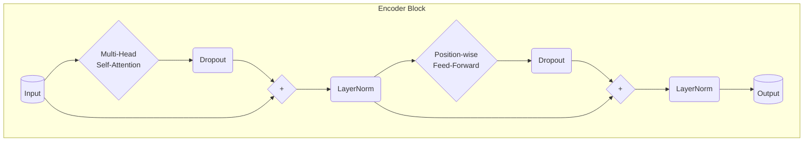

# Transformer Encoder Block

## Overview

The Transformer Encoder is composed of a stack of identical Encoder Blocks (e.g., N=6 in the original paper). Each Encoder Block processes the sequence output by the previous block (or the initial embeddings + positional encodings for the first block) and produces an output sequence of the same dimension.

Each Encoder Block has two main sub-layers:

1.  **Multi-Head Self-Attention Mechanism:** Allows each position in the input sequence to attend to all positions (including itself) to capture contextual relationships.
2.  **Position-wise Fully Connected Feed-Forward Network (FFN):** A simple two-layer MLP applied independently to each position.

Crucially, each of these sub-layers employs a residual connection around it, followed by Layer Normalization (the "Add & Norm" step).

## Structure of a Single Encoder Block

Let the input to the Encoder Block be $X \in \mathbb{R}^{\text{batch_size} \times \text{seq_len} \times d_{\text{model}}}$.

1.  **Multi-Head Self-Attention Sub-layer:**

    - Calculate the self-attention output: $\text{AttentionOut} = \text{MultiHeadAttention}(Q=X, K=X, V=X, \text{mask=padding_mask})$
    - Apply dropout (often done within the attention mechanism or immediately after).
    - **Add & Norm 1:** $\text{NormAttentionOut} = \text{LayerNorm}(X + \text{Dropout}(\text{AttentionOut}))$

2.  **Position-wise Feed-Forward Sub-layer:**
    - Take the output from the first Add & Norm step as input: $\text{FFNInput} = \text{NormAttentionOut}$.
    - Calculate the FFN output: $\text{FFNOut} = \text{PositionWiseFeedForward}(\text{FFNInput})$
    - Apply dropout.
    - **Add & Norm 2:** $\text{EncoderBlockOutput} = \text{LayerNorm}(\text{FFNInput} + \text{Dropout}(\text{FFNOut}))$

The final $\text{EncoderBlockOutput} \in \mathbb{R}^{\text{batch_size} \times \text{seq_len} \times d_{\text{model}}}$ has the same dimensions as the input $X$ and serves as the input to the next Encoder Block in the stack.

## Diagram

_(Note: Dropout placement can vary slightly between implementations, sometimes occurring within the sub-layers themselves or only before the final LayerNorm in each Add & Norm step.)_

## Implementation Details

- **Inputs:** The block typically takes the sequence tensor and an optional padding mask (to prevent attention to padding tokens) as input.
- **Components:** It instantiates `MultiHeadAttention`, `PositionWiseFeedForward`, two `LayerNorm` layers, and potentially `Dropout` layers.
- **Forward Pass:** Implements the two Add & Norm steps described above.
