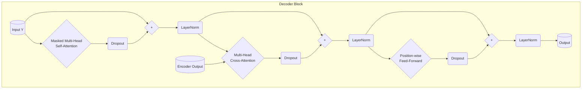

# Transformer Decoder Block

## Overview

The Transformer Decoder is composed of a stack of identical Decoder Blocks (e.g., N=6 in the original paper), similar to the Encoder. Each Decoder Block takes the output from the previous Decoder block (or the target sequence embeddings + positional encodings for the first block) and the final output from the _entire Encoder stack_. It produces an output sequence of the same dimension.

Each Decoder Block has **three** main sub-layers:

1.  **Masked Multi-Head Self-Attention Mechanism:** Allows each position in the _decoder's input sequence_ to attend to previous positions (including itself) in that sequence. The masking ensures causality – predictions for position $i$ can only depend on known outputs at positions less than $i$.
2.  **Multi-Head Cross-Attention (Encoder-Decoder Attention) Mechanism:** Allows each position in the decoder's sequence to attend to all positions in the _encoder's output sequence_. This is where information from the source sequence is incorporated.
3.  **Position-wise Fully Connected Feed-Forward Network (FFN):** Identical in structure to the FFN used in the Encoder blocks.

As with the Encoder, each of these sub-layers employs a residual connection around it, followed by Layer Normalization (the "Add & Norm" step).

## Structure of a Single Decoder Block

Let the input from the previous Decoder layer (or target embeddings) be $Y \in \mathbb{R}^{\text{batch_size} \times \text{target_seq_len} \times d_{\text{model}}}$.
Let the output from the Encoder stack be $\text{EncoderOutput} \in \mathbb{R}^{\text{batch_size} \times \text{source_seq_len} \times d_{\text{model}}}$.

1.  **Masked Multi-Head Self-Attention Sub-layer:**

    - Calculate masked self-attention output: $\text{MaskedAttnOut} = \text{MultiHeadAttention}(Q=Y, K=Y, V=Y, \text{mask=look_ahead_mask})$
    - Apply dropout.
    - **Add & Norm 1:** $\text{NormMaskedAttnOut} = \text{LayerNorm}(Y + \text{Dropout}(\text{MaskedAttnOut}))$

2.  **Multi-Head Cross-Attention (Encoder-Decoder) Sub-layer:**

    - Take the output from the first Add & Norm step as the **Query** ($Q$).
    - Take the **EncoderOutput** as the **Key** ($K$) and **Value** ($V$).
    - Calculate cross-attention output: $\text{CrossAttnOut} = \text{MultiHeadAttention}(Q=\text{NormMaskedAttnOut}, K=\text{EncoderOutput}, V=\text{EncoderOutput}, \text{mask=padding_mask})$
      - Note: The `padding_mask` here corresponds to padding in the _source_ sequence (from the encoder).
    - Apply dropout.
    - **Add & Norm 2:** $\text{NormCrossAttnOut} = \text{LayerNorm}(\text{NormMaskedAttnOut} + \text{Dropout}(\text{CrossAttnOut}))$

3.  **Position-wise Feed-Forward Sub-layer:**
    - Take the output from the second Add & Norm step as input: $\text{FFNInput} = \text{NormCrossAttnOut}$.
    - Calculate the FFN output: $\text{FFNOut} = \text{PositionWiseFeedForward}(\text{FFNInput})$
    - Apply dropout.
    - **Add & Norm 3:** $\text{DecoderBlockOutput} = \text{LayerNorm}(\text{FFNInput} + \text{Dropout}(\text{FFNOut}))$

The final $\text{DecoderBlockOutput} \in \mathbb{R}^{\text{batch_size} \times \text{target_seq_len} \times d_{\text{model}}}$ has the same dimensions as the Decoder input $Y$ and serves as the input to the next Decoder Block in the stack.

## Diagram

## Implementation Details

- **Inputs:** The block takes the target sequence tensor $Y$, the encoder output tensor, an optional look-ahead mask (for masked self-attention), and an optional padding mask (for cross-attention, masking padding in the encoder output).
- **Components:** Instantiates _two_ `MultiHeadAttention` modules, one `PositionWiseFeedForward`, three `LayerNorm` layers, and potentially three `Dropout` layers.
- **Forward Pass:** Implements the three Add & Norm steps described above, carefully passing the correct inputs (Q, K, V) and masks to each attention layer.
